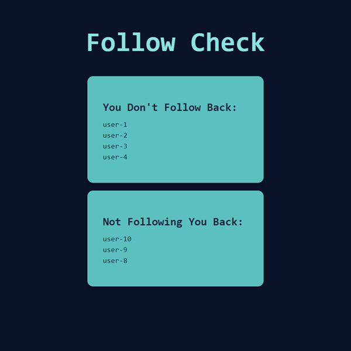

# Follow Check

**Follow Check** is a web app to help you check your GitHub following relationships.

Running this tool will display 2 lists:
1) Users who follow you, but you don’t follow back
2) Users you follow, but who don’t follow you back

## Final Product

## Purpose

This project was created by [me](https://github.com/kazvee) as a learning project to help me manage my GitHub follows/followers.

## Dependencies

- [Node](https://nodejs.org) (v20 was used when building this)
- [Axios](https://www.npmjs.com/package/axios)
- [Dotenv](https://www.npmjs.com/package/dotenv)
- [Express](https://expressjs.com)

## Installation

- Fork this repository to your own GitHub account
- Clone your fork onto your local device
- Install all dependencies with `npm i` (or `npm install`)
- Create a new `.env` file with your GitHub username (check `.env.example` file for guidance)
- Start the server with `npm start` (or `npm run start`)
- Navigate to [http://localhost:3000](http://localhost:3000/) in your browser
